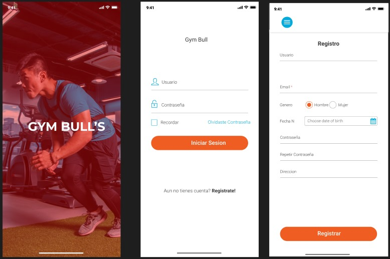
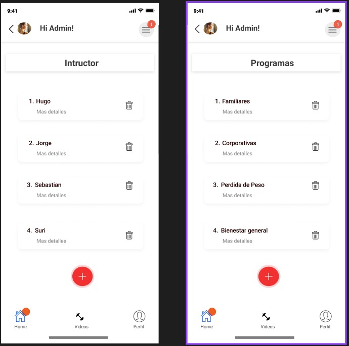
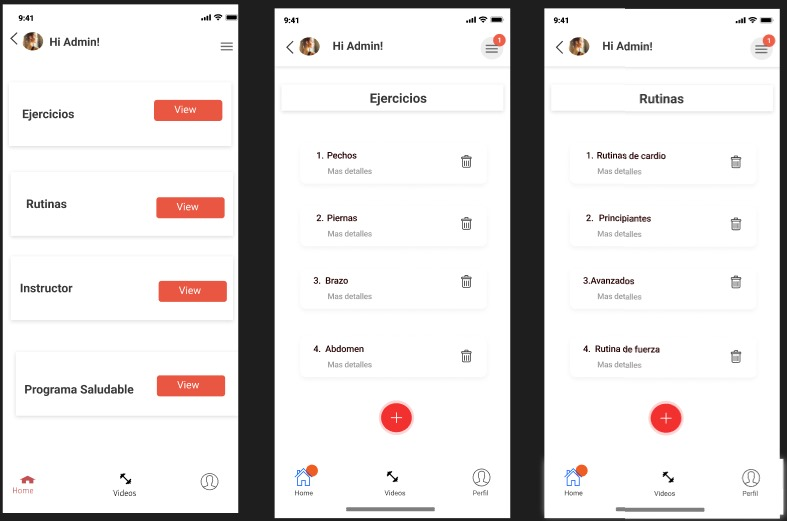
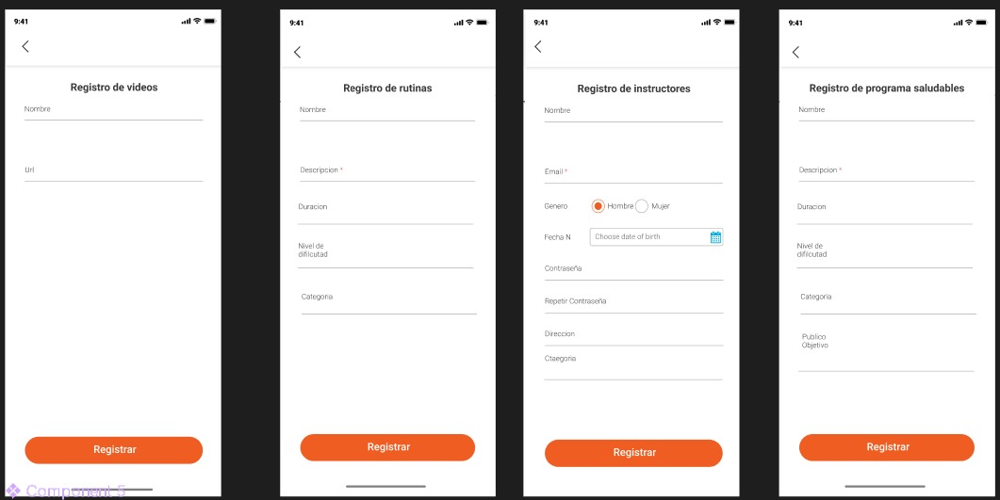

 
 

<h1 align="center"> Universidad Tecnológica de Xicotepec de Juárez </h1>
<h1 align="center"> Ingeniería en Desarrollo y Gestión de Software </h1>
<h1 align="center"> DMI_INTEGRADORA_DEWEB </h1>
<h2 align="center"> Decimo Cuatrimestre Grupo B </h2>
 

| NOMBRE DE LA EMPRESA         | DeWeb                       | 
|------------------------------|-----------------------------|
| PROYECTO                     | Aplicacion Movil GYM BULL´S        |           
| UNIDAD DE NEGOCIO            | Training                    |             

 
 

  
| LOGO DEl SITIO  | LOGO DE LA EMPRESA | 
|:------------- |:---------------:| 
||
  

 

## Organigrama del equipo
 

  

## Integrantes 
 

| Nombre y Apellido            | Cargo                   | Departamento u Organización    |
|------------------------------|-------------------------|------------|
|Jorge Cazarez Cruz            | Lider/DB Manager        | DeWeb      |           
|Hugo Sanchez Gonzalez         | Documentador            | DeWeb      |            
|Suri Jazmin Peña Lira         | Desarrollador Backend   | DeWeb      |                      
|Sebastian Marquez Garcia      | Desarrollador Frontend  | DeWeb      |

 

## Propuesta de Plan de Trabajo       

  

 

## Objetivo General

Desarrollar un módulo de entrenamiento dentro de una aplicación móvil para el gimnasio. Este módulo estará destinado a optimizar la gestión integral de la institución, brindando una plataforma digital que mejore la experiencia tanto de los empleados como de los miembros. Además, se buscará proporcionar herramientas que faciliten la creación, seguimiento y personalización de programas de entrenamiento, rutinas de ejercicios y sesiones específicas para los clientes del gimnasio. Todo esto con el apoyo de instructores y el uso de una dieta adecuada, promoviendo así la adopción de hábitos saludables y una mejor interacción entre el personal y los usuarios.

## Objetivos Específicos
1. **Inicio de Sesión:** Diseñar una pantalla de inicio de sesión intuitiva, atractiva y segura que permita a los usuarios acceder a la aplicación móvil del gimnasio, siguiendo el diseño presentado en el mockup.
2. **Módulo de Creación de Rutinas:** Implementar un formulario interactivo en la app móvil que permita a los instructores agregar nuevos ejercicios, establecer repeticiones, series y descansos, validando los datos ingresados para garantizar la coherencia de las rutinas.
3. **Módulo de Lectura de Rutinas:** Diseñar una pantalla clara y organizada que muestre las rutinas existentes, permitiendo a los usuarios ver detalles específicos de cada rutina, como ejercicios incluidos, series y repeticiones.
4. **Módulo de Actualización de Rutinas:** Habilitar la edición de rutinas existentes desde la aplicación, permitiendo a los instructores realizar cambios en los ejercicios, repeticiones y otros detalles según sea necesario.
5. **Módulo de Eliminación de Rutinas:** Integrar una función en la app que permita a los instructores eliminar rutinas obsoletas o incorrectas de manera segura y eficiente.
6. **Módulo de Programas Saludables:** Diseñar una pantalla que muestre información detallada sobre los programas saludables ofrecidos por el gimnasio, siguiendo el diseño presentado en el mockup. Incluir tablas y datos relevantes como nombres de programas, descripciones y beneficios.
7. **Dashboard de Seguimiento:** Desarrollar un dashboard interactivo en la app que proporcione a los usuarios una visión general de su progreso en el gimnasio. Incluir gráficos y estadísticas que muestren datos clave, como el rendimiento en las rutinas, la frecuencia de entrenamiento y el cumplimiento de los programas saludables.

## Requerimientos Funcionales
1. La aplicación debe asignar permisos y accesos específicos a cada rol de usuario.
2. La aplicación debe realizar las siguientes operaciones en el apartado de rutinas: creación, edición, eliminación y actualización.
3. La aplicación debe contener un apartado que muestre la información de los programas saludables disponibles en el gimnasio.
4. La aplicación debe mostrar un monitoreo de los programas de los miembros.
5. La aplicación debe realizar operaciones de lectura a tablas externas del departamento de training (Dietas).
6. La aplicación debe permitir operaciones CRUD a miembros en el apartado de rutinas.
7. La aplicación debe permitir visualización y filtro de programas saludables disponibles para los miembros.
8. La aplicación debe reflejar el seguimiento del programa saludable por medio de una gráfica.
9. La aplicación debe reflejar el seguimiento del programa saludable al que el usuario esté inscrito.
10. La aplicación debe mostrar únicamente las vistas que le correspondan al departamento.
11. La aplicación debe incluir 4 dashboards de monitoreo.
12. La aplicación debe incluir 2 dashboards con una base de datos SQL.
13. La aplicación debe incluir 2 dashboards con una base de datos NoSQL.
14. La aplicación debe contener datos dinámicos.
15. La aplicación debe contener un archivo técnico de documentación.

## Requerimientos No Funcionales
1. La aplicación móvil debe ser capaz de soportar una gran cantidad de usuarios simultáneos sin afectar el rendimiento.
2. El tiempo de respuesta de la aplicación debe ser rápido y fluido, además las pantallas deben cargarse rápidamente.
3. La aplicación debe ser escalable para poder adaptarse al crecimiento del gimnasio.
4. Se deben implementar medidas de seguridad para evitar el acceso no autorizado a la información, como cifrado de datos.
5. La aplicación debe cumplir con las leyes de protección de datos.
6. La aplicación debe ser fácil de usar para todos los usuarios; la interfaz tiene que ser intuitiva y sencilla.
7. La aplicación debe proteger la información confidencial de los clientes y del personal.
8. Se debe proporcionar una documentación completa de la aplicación.
9. La documentación debe incluir información sobre el uso de la aplicación móvil.
10. La documentación debe incluir un organigrama de trabajo.

## Reglas de Negocio 
1. Los entrenadores deben comunicarse claramente con los clientes y estar disponibles para discutir su progreso y cualquier inquietud que puedan tener.
2. Cada cliente debe recibir un plan de entrenamiento personalizado según sus objetivos y necesidades específicas.
3. Los entrenadores deben mantenerse actualizados en las últimas tendencias de fitness y técnicas de entrenamiento a través de la capacitación continua.
4. Los entrenadores deben ser conscientes de la diversidad de los clientes y adaptar sus enfoques de entrenamiento según las necesidades individuales.
5. Los entrenadores deben colaborar con otros departamentos del gimnasio, como nutrición, para ofrecer un enfoque integral para el bienestar de los clientes.
6. Se espera que los entrenadores mantengan los estándares de calidad del gimnasio y representen a la marca de manera positiva en todo momento.
7. Los entrenadores deben proporcionar retroalimentación constructiva a los clientes para ayudarles a mejorar su técnica y alcanzar sus objetivos.
8. Los entrenadores deben seguir un código ético que prohíba cualquier tipo de comportamiento inapropiado o abusivo hacia los clientes.
9. Se espera que los entrenadores motiven y alienten a los clientes para que alcancen sus objetivos.
10. Los entrenadores deben ser flexibles para adaptarse a las necesidades cambiantes de los clientes y reprogramar sesiones según sea necesario.
11. Los entrenadores deben mantener registros precisos del progreso de cada cliente y ajustar sus programas según sea necesario.
12. Los entrenadores deben respetar la privacidad y confidencialidad de la información personal de los clientes.
13. Se espera que los entrenadores traten a los clientes con respeto y consideración en todo momento, independientemente de su nivel de condición física.
14. Se prohíbe a los miembros del gimnasio participar en discusiones agresivas, peleas o cualquier actividad que perturbe el ambiente de entrenamiento.
15. Se prohíbe a los miembros llevar comida o bebida no autorizada en las áreas de entrenamiento, excepto aquellas permitidas por el gimnasio para su consumo durante el ejercicio.
16. Se prohíbe a los miembros participar en cualquier conducta inapropiada, incluyendo acoso, discriminación, o cualquier comportamiento que haga sentir incómodos a otros usuarios del gimnasio.
17. Los instructores pueden crear y gestionar las clases.
18. Se puede registrar y gestionar las rutinas del gimnasio en la aplicación móvil.
19. Los miembros no pueden tener un dashboard de seguimiento hasta que estén inscritos en un programa saludable.
20. No se pueden realizar operaciones CRUD si no son instructores verificados.

  ### Sketches

  
  
  

### Wireframes

  
  

### Diseño Figma

  
  
  
  

